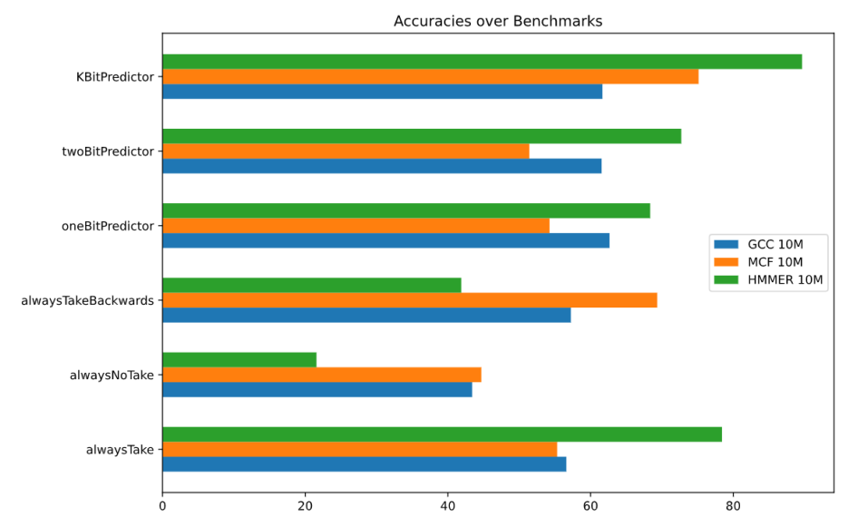
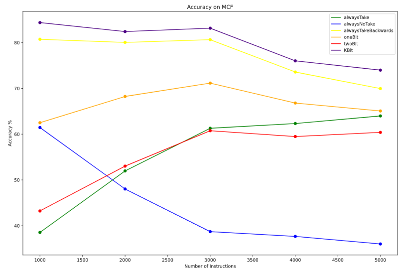
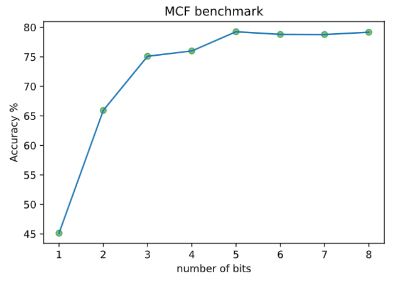
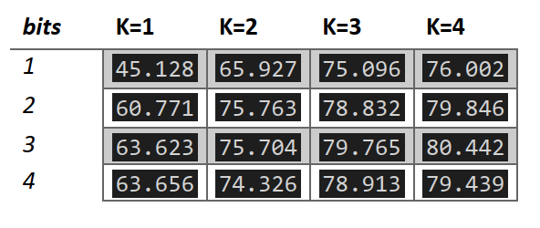

# Hardware-Branch-Predictors

In this repository we have tried and compared several elementary hardware branch predictors. This mainly includes:
 
 __Static Predictors__
 - always Take predictors
 - always don't take predictors
 - always take backwards
 
 __Dynamic Predictors__
 - simple single bit predictor
 - simple two bit predictor
 - branch history table with k bit predictor
 
 We have tried out specifically several benchamrks from SPEC96. Precisely we have included __GCC__ and __MCF__ among integer benchmarks and __HMMER__ for the floating point benchmarks. The study included detailed profiling and performance analysis of the above predictors. Here are some of those notable conclusions that were obtained.
 
 
 
 We notice from Figure 1 that in general the Kbit Predictor has shown comparable or better performance across benchmarks. This, shows us that the Kbit predictor is indeed an optimal choice for a branch prediction mechanism. Better performance with alwaysTakeBackwards predictor indicates presence of looping constructs in the code, while alwaysTake performs better with conditional constructs.
 
 
 
 An important observation from the empirical analysis (Figure 2) is that the Kbit predictor mechanism consistently performs better even as there is increase in number of instructions. Another important factor is the role of warm up period. We see that with large warm up period the performance in kbit predictor increases greatly whereas some predictors like alwaysNoTake degrade in performance with longer time showing saturation in the states that are learned by the automaton.
 
 
 
 We also, checked for performance of the kbit predictor with increasing number of bits the performance saturates at around 5 bits. But with 5 bits we encode 32 states which leads to longer warm up time for populating the states. In general increasing PC bits and increasing states in K bit counter improves performance, but always not so. Infact performance may be worser due to the warmup period being longer beyond increasing the size of bits as indicated in Table 1 shown below.
 
 
